```{r setup, include=FALSE}
knitr::opts_chunk$set(echo = FALSE)
```

# Artículos en revistas arbitradas

Bianchi, C., Galaso, P.,& Palomeque, S. (2023). Knowledge complexity and brokerage in inter-city networks. [*The Journal of Technology Transfer*](https://www.springer.com/journal/10961){target="_blank"}. <https://doi.org/10.1007/s10961-023-10025-x>{target="_blank"}

<div>
<p style = 'text-align:center;'>
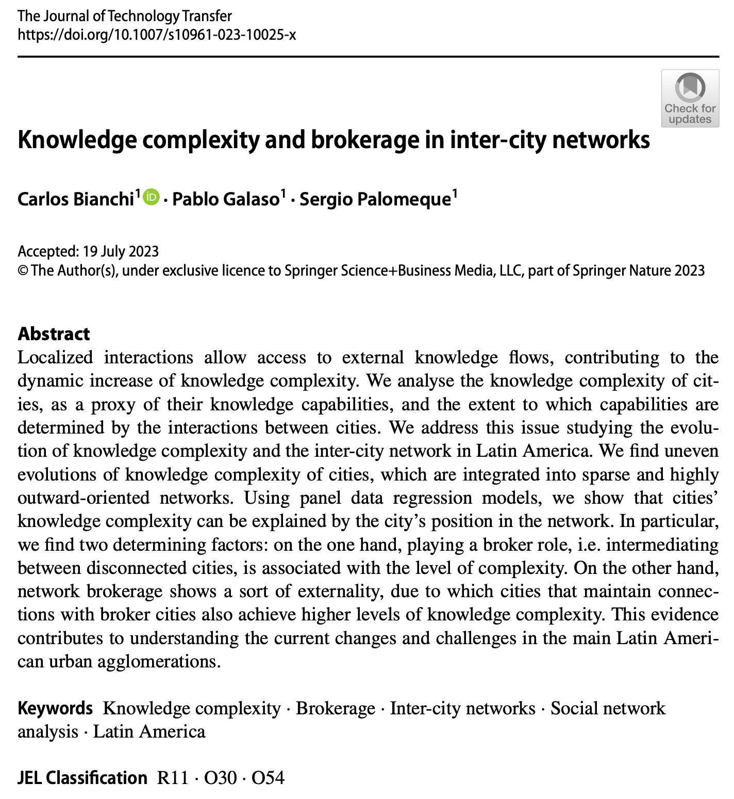
<!-- 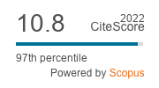 -->
</p>
</div>

- Bianchi, C., Galaso, P., & Palomeque, S. (2023). The trade-offs of brokerage in inter-city innovation networks. [*Regional Studies*](https://www.tandfonline.com/journals/cres20){target="_blank"}, 57(2), 225–238. <https://doi.org/10.1080/00343404.2021.1973664>{target="_blank"}

<div>
<p style = 'text-align:center;'>
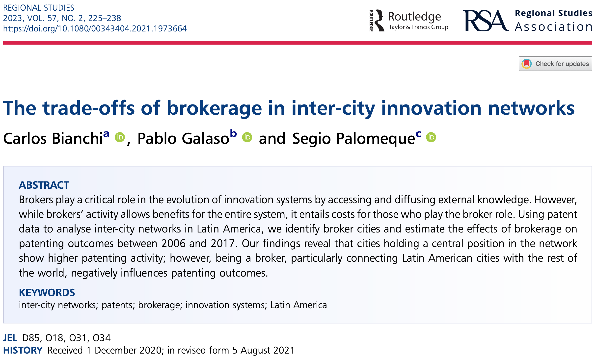
<!-- 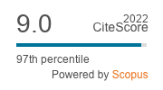 -->
</p>
</div>

- Bianchi, C., Galaso, P., & Palomeque, S. (forthcoming). Absorptive capacities and external openness in underdeveloped Innovation Systems: A patent network analysis for Latin American countries 1970-2017. [*Cambridge Journal of Economics*](https://academic.oup.com/cje){target="_blank"}. <https://doi.org/10.1093/cje/bead034>{target="_blank"}

<!-- <div> -->
<!-- <p style = 'text-align:center;'> -->
<!-- 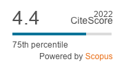 -->
<!-- </p> -->
<!-- </div> -->

- Bianchi, C., Galaso, P., Palomeque, S., Picasso, S., & Rodríguez Miranda, A. (2023). Innovación en Uruguay entre 1970 y 2018: una aproximación a través de los datos de patentes. [*Revista Española de Documentación Científica*](https://redc.revistas.csic.es/index.php/redc){target="_blank"}, 46(3), e364. <https://doi.org/10.3989/redc.2023.3.1955>{target="_blank"}

<div>
<p style = 'text-align:center;'>
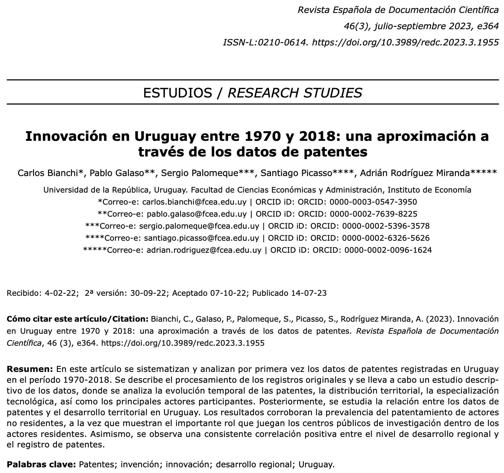
<!-- 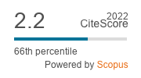 -->
</p>
</div>

- Bianchi, C., Galaso, P., & Palomeque, S. (2021). Patent Collaboration Networks in Latin America: Extra-regional Orientation and Core-Periphery Structure. [*Journal of Scientometric Research*](https://jscires.org/){target="_blank"}, 10(1s), s59–s70. <https://doi.org/10.5530/jscires.10.1s.22>{target="_blank"}

<div>
<p style = 'text-align:center;'>
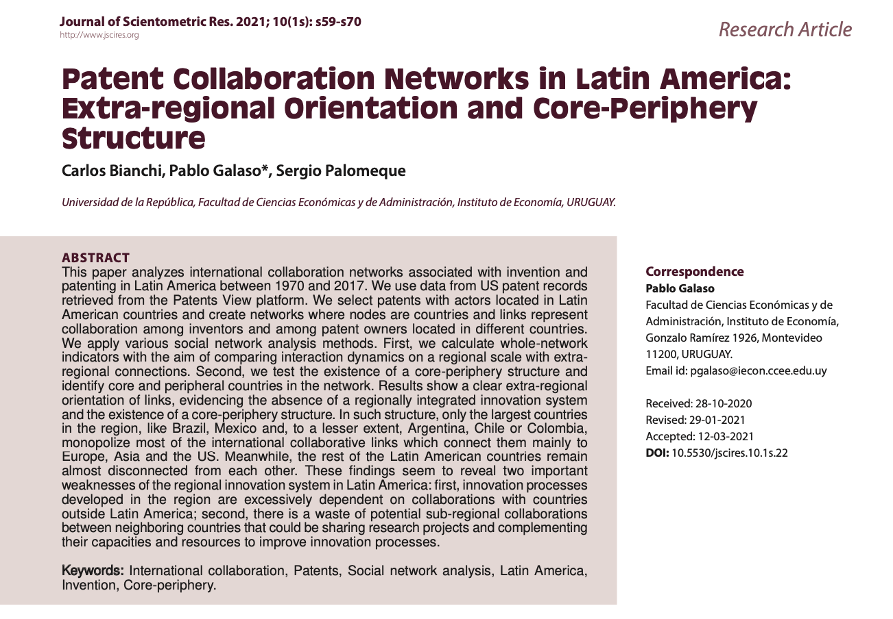
<!-- 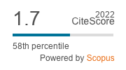 -->
</p>
</div>

- Brida, J. G., & Palomeque, S. (2020). Innovation networks: an agent-based model. [*International Journal of Foresight and Innovation Policy*](https://www.inderscience.com/jhome.php?jcode=ijfip){target="_blank"}, 14(2/3/4), 198. <https://doi.org/10.1504/IJFIP.2020.111223>{target="_blank"}

<div>
<p style = 'text-align:center;'>
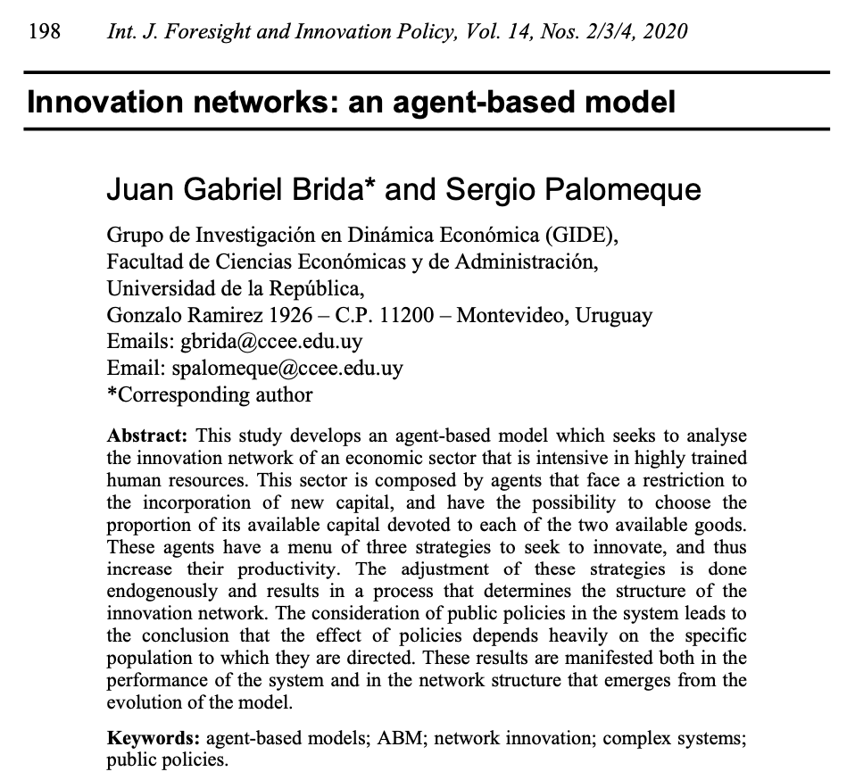
<!-- 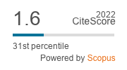 -->
</p>
</div>

<!-- # Papers under review -->

<!-- - Galaso, P., & Palomeque, S. The effects of local and global networks on cities’ innovation: improving locally while competing globally. En proceso de revisión de pares en *Research Policy*; <https://www.sciencedirect.com/journal/research-policy> -->

# Capítulos de libros

- Galaso, P., & Palomeque, S. (forthcoming). Connecting innovation poles with lagging territories: how do collaborations with Europe and Asia influence innovation in Latin American cities? In L. Lazzeretti, T. Ozeki, S. R. Sedita, & F. Capone (Eds.), *Rethinking Clusters in Times of Uncertainty: Japanese and European Perspectives*. Edward Elgar Publishing Ltd.

# Documentos de trabajo

- Bianchi, C., Galaso, P., Palomeque, S., Picasso, S., & Rodríguez, A. (2021). Invención y patentes en Uruguay: evidencia empírica entre 1970 y 2018. *Serie Documentos de Trabajo*. DT 25/2021. Instituto de Economía, Facultad de Ciencias Económicas y Administración, Universidad de la República, Uruguay. [Link](<https://iecon.fcea.udelar.edu.uy/es/autores/item/dt-2521-invencion-y-patentes-en-uruguay-evidencia-empirica-entre-1970-y-2018.html?category_id=84>){target="_blank"}
- Bianchi, C., Galaso, P., Palomeque, S. (2021) “The tradeoffs of brokerage in innovation networks: a study of Latin American cities”. *Serie Documentos de Trabajo*, DT 21/2021. Instituto de Economía, Facultad de Ciencias Económicas y Administración, Universidad de la República, Uruguay. [Link](<https://iecon.fcea.udelar.edu.uy/es/autores/item/dt-2121-the-tradeoffs-of-brokerage-in-innovation-networks-a-study-of-latin-american-cities.html?category_id=84>){target="_blank"}
- Bianchi, C., Galaso, P., Palomeque, S. (2020) “Invention and Collaboration Networks in Latin America: Evidence from Patent Data”. *Serie Documentos de Trabajo*, DT 04/2020. Instituto de Economía, Facultad de Ciencias Económicas y Administración, Universidad de la República, Uruguay. [Link](<https://iecon.fcea.udelar.edu.uy/es/autores/item/dt-0420-invention-and-collaboration-networks-in-latin-america-evidence-from-patent-data.html?category_id=84>){target="_blank"}

# Trabajo en progreso

- Bianchi, C., Galaso, P., & Palomeque, S. Cities’ technological portfolio: internal absorptive capacities and external collaboration complementarity. Objective journal: [*Economic Geography*](https://www.tandfonline.com/journals/recg20){target="_blank"}
- Bianchi, C., Palomeque, S & Rapini, M. University patents in a peripheral system: from individual-led towards an organizational change in patenting activities. Objective journal: [*Science and Public Policy*](https://academic.oup.com/spp){target="_blank"}
- Galaso, P., \& Palomeque, S. The effects of local and global networks on cities’ innovation: improving locally while competing globally. Objective journal: [*Research Policy*](https://www.sciencedirect.com/journal/research-policy){target="_blank"}
- Galaso, P., \& Palomeque, S. Brain drain or brain circulation? a study of the academic collaboration network in Uruguay. Objective journal: [*Scientometrics*](https://www.springer.com/journal/11192){target="_blank"}
- Palomeque, S. Knowledge relatedness and technological diversification. The role of stability, alternatives and redundancy in the diversification. Objective journal: [*Regional Studies*](https://www.tandfonline.com/journals/cres20){target="_blank"}
- Palomeque, S. The topology of the knowledge relatedness network of technologies. Objective journal: [*Social Networks*](https://www.journals.elsevier.com/social-networks){target="_blank"}

<!-- # Trabajos en marcha -->

<!-- - Galaso, P., Palomeque, S., & Picasso, S. How to find the A-Team. A methodological proposal for identifying teams in co-authorship networks. Revista objetivo: *Social Networks*; [Link](https://www.journals.elsevier.com/social-networks) -->
<!-- - Bianchi, C., Galaso, P., Picasso, S., Palomeque, S. & Rodríguez Miranda, A. Redes de invención en Uruguay: estructura y evolución entre 1970 y 2018. Revista objetivo: *REDES Revista hispana para el análisis de redes sociales*; [Link](<https://revistes.uab.cat/redes/index>) -->
<!-- - Bianchi, C., Galaso, P. & Palomeque, S. Structural holes and complexity. Revista objetivo: *Industrial and Corporate Change*; [link](https://academic.oup.com/icc/pages/call-for-papers) -->
<!-- - Galaso, P. & Palomeque, S. Local Buzz and Global Pipelines in invention networks of cities. Revista objetivo: *Journal of Economic Geography*; [link](https://academic.oup.com/joeg) -->