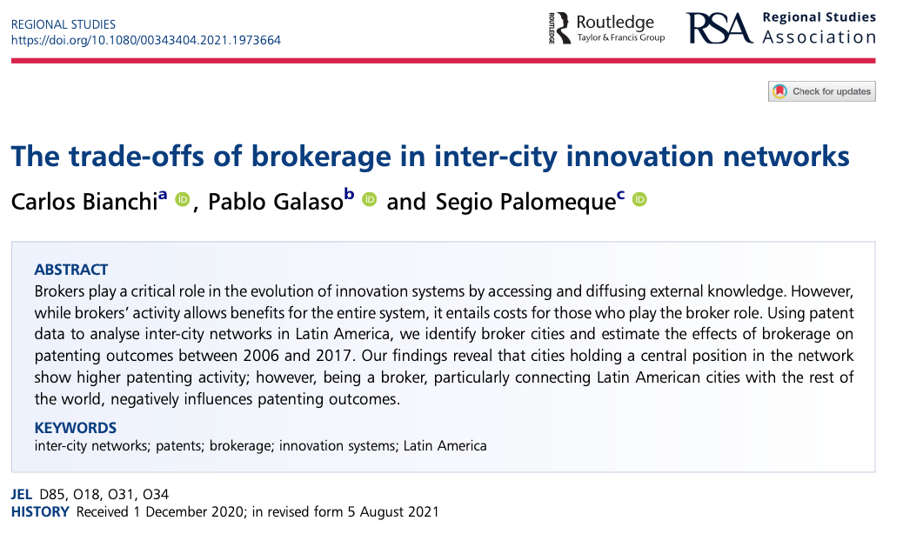
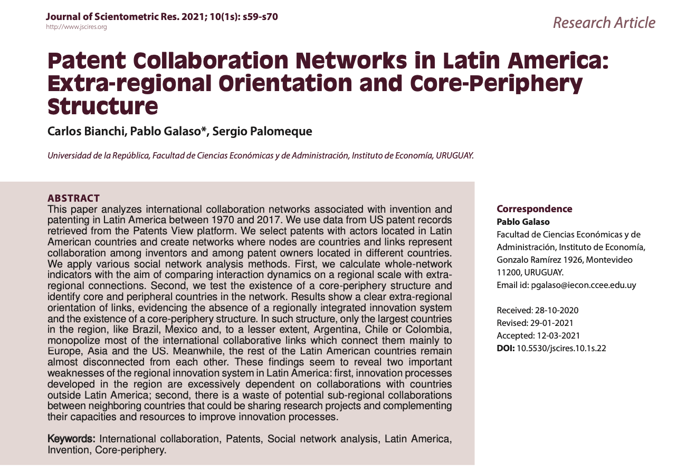
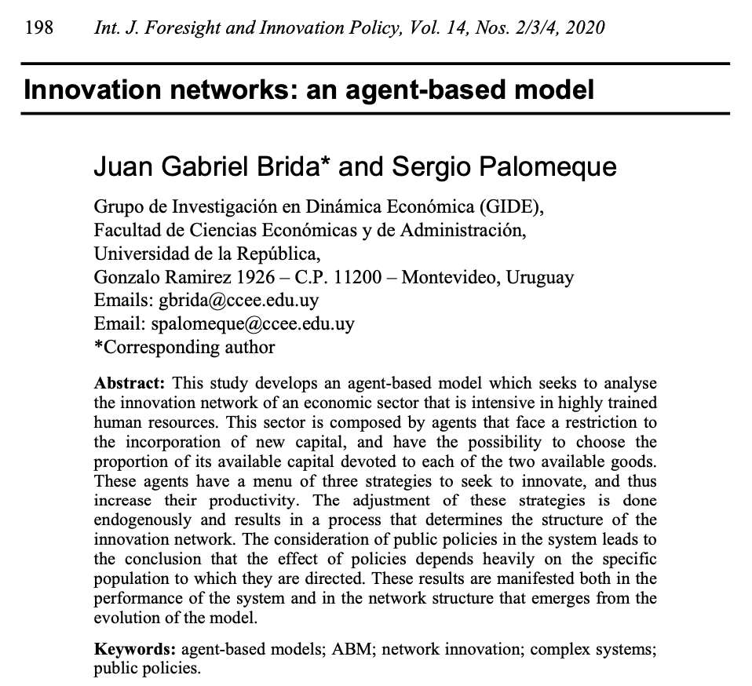

```{r setup, include=FALSE}
knitr::opts_chunk$set(echo = FALSE)
```

# Publicaciones

- Bianchi, C., Galaso, P., & Palomeque, S. (2021). The trade-offs of brokerage in inter-city innovation networks. *Regional Studies*, 1–14. <https://doi.org/10.1080/00343404.2021.1973664>

<div>
<p style = 'text-align:center;'>

</p>
</div>

- Bianchi, C., Galaso, P., & Palomeque, S. (2021). Patent Collaboration Networks in Latin America: Extra-regional Orientation and Core-Periphery Structure. *Journal of Scientometric Research*, 10(1s), s59–s70. <https://doi.org/10.5530/jscires.10.1s.22>

<div>
<p style = 'text-align:center;'>

</p>
</div>

- Brida, J. G., & Palomeque, S. (2020). Innovation networks: an agent-based model. *International Journal of Foresight and Innovation Policy*, 14(2/3/4), 198. <https://doi.org/10.1504/IJFIP.2020.111223>

<div>
<p style = 'text-align:center;'>

</p>
</div>

# Documentos de trabajo

- Bianchi, C., Galaso, P., Palomeque, S., Picasso, S., & Rodríguez, A. (2021). Invención y patentes en Uruguay: evidencia empírica entre 1970 y 2018. *Serie Documentos de Trabajo*. Montevideo.
- Bianchi, C., Galaso, P., Palomeque, S. (2021) “The tradeoffs of brokerage in innovation networks: a study of Latin American cities”. *Serie Documentos de Trabajo*, DT 21/2021. Instituto de Economía, Facultad de Ciencias Económicas y Administración, Universidad de la República, Uruguay. [Link](<http://www.iecon.ccee.edu.uy/dt-21-21-the-tradeoffs-of-brokerage-in-innovation-networks-a-study-of-latin-american-cities/publicacion/841/es/>)
- Bianchi, C., Galaso, P., Palomeque, S. (2020) “Invention and Collaboration Networks in Latin America: Evidence from Patent Data”. *Serie Documentos de Trabajo*, DT 04/2020. Instituto de Economía, Facultad de Ciencias Económicas y Administración, Universidad de la República, Uruguay. [Link](<http://www.iecon.ccee.edu.uy/dt-04-20-invention-and-collaboration-networks-in-latin-america-evidence-from-patent-data/publicacion/724/es/>)

# Trabajos en revisión de pares

- Bianchi, C., Galaso, P., & Palomeque, S. Absorptive capacities and external openness in underdeveloped Innovation Systems: A patent network analysis for Latin American countries 1970-2017. En proceso de revisión de pares desde febrero de 2021 (ID number CJE-2021-059) en el *Cambridge Journal of Economics*; [Link](<https://academic.oup.com/cje>)
- Bianchi, C., Galaso, P., Picasso, S., Palomeque, S. & Rodríguez Miranda, A. Invención y patentes en Uruguay: evidencia empírica entre 1970 y 2018. En proceso de revisión de pares desde febrero de 2022 (ID number 1.955) en *Revista española de documentación científica*; [link](https://redc.revistas.csic.es/index.php/redc/index)

# Trabajos en marcha

- Galaso, P., Palomeque, S., & Picasso, S. How to find the A-Team. A methodological proposal for identifying teams in co-authorship networks. Revista objetivo: *Social Networks*; [Link](https://www.journals.elsevier.com/social-networks)
- Bianchi, C., Galaso, P., Picasso, S., Palomeque, S. & Rodríguez Miranda, A. Redes de invención en Uruguay: estructura y evolución entre 1970 y 2018. Revista objetivo: *REDES Revista hispana para el análisis de redes sociales*; [Link](<https://revistes.uab.cat/redes/index>)
- Bianchi, C., Galaso, P. & Palomeque, S. Structural holes and complexity. Revista objetivo: *Industrial and Corporate Change*; [link](https://academic.oup.com/icc/pages/call-for-papers)
- Galaso, P. & Palomeque, S. Local Buzz and Global Pipelines in invention networks of cities. Revista objetivo: *Journal of Economic Geography*; [link](https://academic.oup.com/joeg)